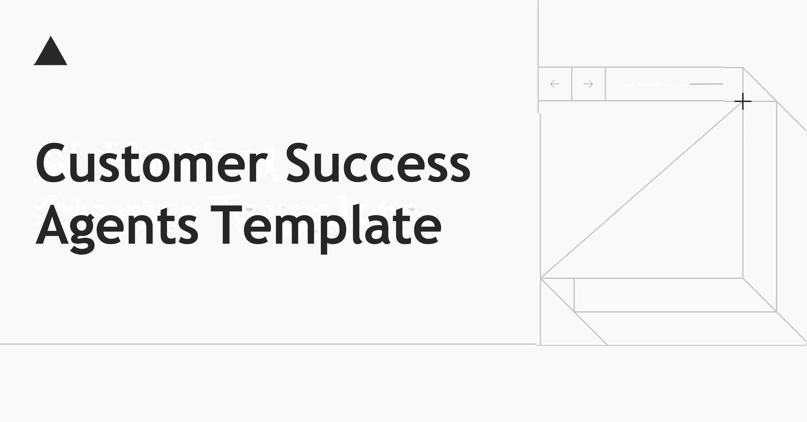

<a href="https://success-agents.vercel.app/">
  
  <h1 align="center">Customer Success Agents Chatbot</h1>
</a>

<p align="center">
  An Open-Source AI Chatbot with Specialized Customer Success Agents Built With Next.js and the AI SDK by Vercel.
</p>

<p align="center">
  <a href="#features"><strong>Features</strong></a> ·
  <a href="#model-providers"><strong>Model Providers</strong></a> ·
  <a href="#customer-success-agents"><strong>Customer Success Agents</strong></a> ·
  <a href="#running-locally"><strong>Running locally</strong></a>
</p>
<br/>

## Features

- [Next.js](https://nextjs.org) App Router
  - Advanced routing for seamless navigation and performance
  - React Server Components (RSCs) and Server Actions for server-side rendering and increased performance
- [AI SDK](https://sdk.vercel.ai/docs)
  - Unified API for generating text, structured objects, and tool calls with LLMs
  - Hooks for building dynamic chat and generative user interfaces
  - Supports OpenAI and Anthropic but other models could be added in the future
- [shadcn/ui](https://ui.shadcn.com)
  - Styling with [Tailwind CSS](https://tailwindcss.com)
  - Component primitives from [Radix UI](https://radix-ui.com) for accessibility and flexibility
- Data Persistence
  - [Vercel Postgres powered by Neon](https://vercel.com/storage/postgres) for saving chat history and user data
  - [Vercel Blob](https://vercel.com/storage/blob) for efficient file storage
- [NextAuth.js](https://github.com/nextauthjs/next-auth)
  - Simple and secure authentication
- Specialized Customer Success Agents
  - Intelligent query classification and routing
  - Purpose-built agents for retention, expansion, outreach, and strategy

## Model Providers

This template supports multiple AI models:

- **OpenAI**: GPT-4o and GPT-4o-mini (default)
- **Anthropic**: Claude 3.5 Sonnet
- **Customer Success Agents**: Specialized customer success workflows powered by OpenAI models

You can easily switch between these providers in the chat interface or extend the system with additional models using the [AI SDK](https://sdk.vercel.ai/docs).

## Customer Success Agents

The chatbot includes a sophisticated customer success agent system:

### Orchestrator
The orchestrator analyzes customer queries and intelligently routes them to specialized agents based on:
- Query intent and sentiment
- Customer lifecycle stage
- Issue complexity and business impact

### Specialized Agents

- **Retention Agent**: Focuses on preventing churn, addressing dissatisfaction, and resolving service issues
- **Expansion Agent**: Identifies upselling opportunities, handles feature requests, and manages growth conversations
- **Outreach Agent**: Manages new customer acquisition, re-engagement of dormant accounts, and relationship building
- **Strategy Agent**: Handles complex, multi-faceted issues requiring long-term planning and strategic thinking
- **General Agent**: Handles routine inquiries, provides product information, and manages general communication

Each agent is optimized with specific prompts and behaviors to handle their specialized domain effectively.

  

## Deploy Your Own

[

## Running locally

You will need to use the environment variables [defined in `.env.example`](.env.example) to run the Customer Success AI Chatbot. It's recommended you use [Vercel Environment Variables](https://vercel.com/docs/projects/environment-variables) for this, but a `.env` file is all that is necessary.

> Note: You should not commit your `.env` file or it will expose secrets that will allow others to control access to your various OpenAI and authentication provider accounts.

1. Install Vercel CLI: `npm i -g vercel`
2. Link local instance with Vercel and GitHub accounts (creates `.vercel` directory): `vercel link`
3. Download your environment variables: `vercel env pull`

```bash
pnpm install
pnpm dev
```

Your app template should now be running on [localhost:3000](http://localhost:3000/).
